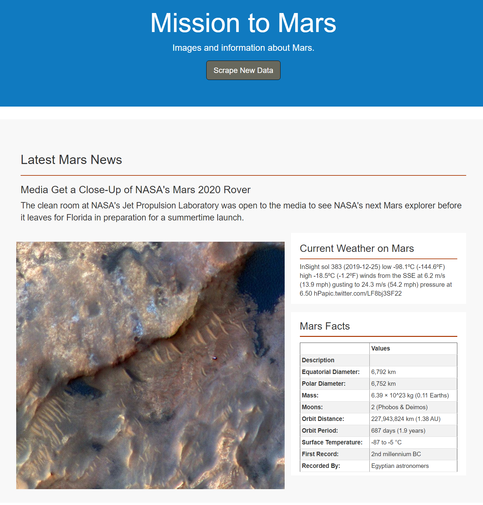
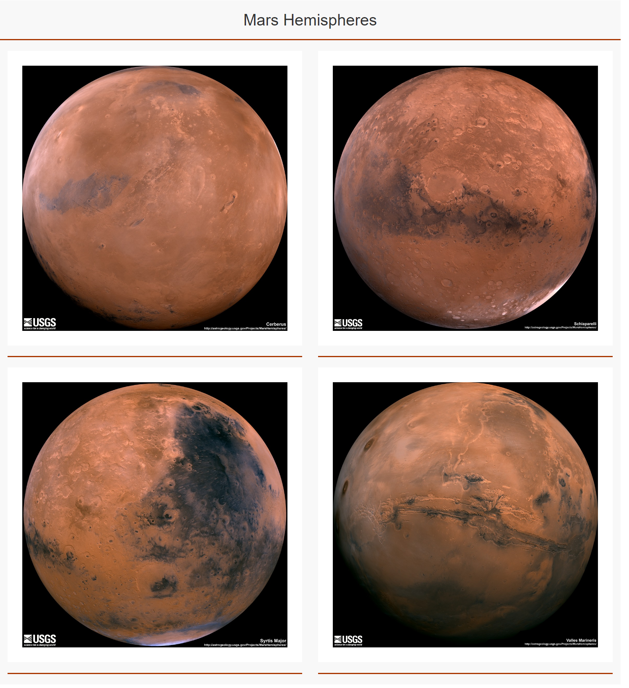

# Web Scraping - Mission to Mars

A web application that scrapes various websites for data related to the Mission to Mars and displays the information in a single HTML page. 

### Languages Used

Python on a Jupyter Notebook using BeautifulSoup, Pandas, and Requests/Splinter libraries.

HTML to create a simple web page.

### Steps
* Web-Scraped data using chromedriver & Request/Splinter to navigate through multiple sites. and BeautifulSoup on a Jupyter notebook.

* Data was scraped from multiple websites related to the Mission To Mars. 

    Mars Mission Latest News - [NASA Mars News Site](https://mars.nasa.gov/news/)
    Mars Planet Images - [Mars_Images](https://www.jpl.nasa.gov/spaceimages/?search=&category=Mars)
    Mars Latest Weather - [Mars_Weather](https://twitter.com/marswxreport?lang=en) 
    Facts about the Mars Planet [Mars Facts](https://space-facts.com/mars/) 
    Images of Mar's Hemispheres (HD) [Mars Hemispheres](https://astrogeology.usgs.gov/search/results?q=hemisphere+enhanced&k1=target&v1=Mars)
    
    
    and use Pandas to scrape the table containing facts about the planet including Diameter, Mass, etc.

* Use Pandas to convert the data to a HTML table string.

* Use MongoDB with Flask templating to create a new HTML page that displays all of the information that was scraped from the URLs above.

* Start by converting your Jupyter notebook into a Python script called `scrape_mars.py` with a function called `scrape` that will execute all of your scraping code from above and return one Python dictionary containing all of the scraped data.

* Next, create a route called `/scrape` that will import your `scrape_mars.py` script and call your `scrape` function.

  * Store the return value in Mongo as a Python dictionary.

* Create a root route `/` that will query your Mongo database and pass the mars data into an HTML template to display the data.

* Create a template HTML file called `index.html` that will take the mars data dictionary and display all of the data in the appropriate HTML elements. Use the following as a guide for what the final product should look like, but feel free to create your own design.

- - -

## Step 3 - Submission

To submit your work to BootCampSpot, create a new GitHub repository and upload the following:

1. The Jupyter Notebook containing the scraping code used.

2. Screenshots of your final application.

3. Submit the link to your new repository to BootCampSpot.

## Hints

* Use Splinter to navigate the sites when needed and BeautifulSoup to help find and parse out the necessary data.

* Use Pymongo for CRUD applications for your database. For this homework, you can simply overwrite the existing document each time the `/scrape` url is visited and new data is obtained.

* Use Bootstrap to structure your HTML template.

### Copyright

Trilogy Education Services © 2019. All Rights Reserved.
